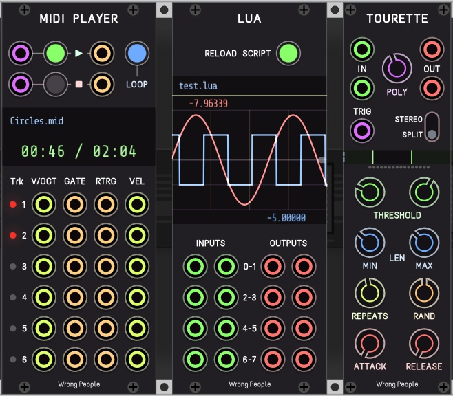

# Wrong People modules

Modules for [VCV Rack](https://vcvrack.com/) 1.x.




## Modules


### MIDI Player

Multitrack MIDI files player.


### Lua

Lua interpreter with 8 inputs, 8 outputs and display.

See [res/lua](./res/lua/api.lua) for available functions and classes.

See also an [examples](./res/lua/examples).


### Tourette

Tourette syndrome simulator.


## Building

[Set up](https://vcvrack.com/manual/Building.html#setting-up-your-development-environment) your build environment, [download](https://vcvrack.com/downloads/) and extract the latest Rack SDK, then:

```
git clone https://github.com/WrongPeople/WrongPeopleVCV.git
cd WrongPeopleVCV
git submodule update --init --recursive
RACK_DIR=path/to/Rack-SDK make
```
